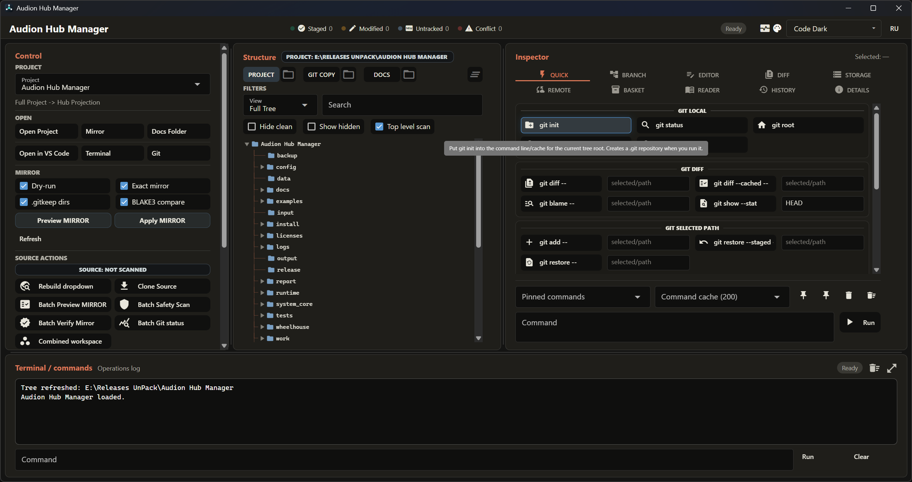

# Audion Hub Manager

<!-- audion:release -->
<p align="center">
  <a href="https://audion.dev/downloads/hub-manager"></a>
  <a href="https://github.com/Tensionix/hub-manager/releases/latest"></a>
  <a href="https://github.com/Tensionix/hub-manager/releases"></a>
  <a href="https://github.com/Tensionix/hub-manager/blob/main/LICENSE"></a>
</p>

**Version 1.10.1** · 2026-09-02 · 183.2 MB

- [Direct download](https://audion.dev/get/hub-manager/1.10.1/Audion_Hub_Manager_v1.10.1_Full.zip) — unmetered, no rate limits
- [Project page](https://audion.dev/downloads/hub-manager) — every version and how to install

<p align="center"></p>

`SHA-256: 0ceceb874b9ee981d1c3d0060ee129d5544d987dfc1ed2a95e99af7460ee520c`

---

An **Audion** tool, published by [Tensionix](https://github.com/Tensionix).
<!-- /audion:release -->


[Русский](README_RU.md) · [User Guide](USER_GUIDE_EN.md) · [Decisions](DECISIONS_EN.md) · [History](CHANGELOG_EN.md)

A portable workshop for projects: see what a project contains, keep its history
in Git, and maintain a clean mirror — without dragging runtimes, caches, logs,
and local keys along with it.

## Why It Exists

A working project has two incompatible properties. It must be complete — with
every temporary file, build leftover, and machine-specific setting, or you
cannot work in it. And it must be surveyable — so its history can be read, its
changes compared, and a copy restored without first working out which files are
source and which are yesterday's build residue.

Those don't fit in one folder. So a project lives in three layers:

```
Source     the complete project, the single source of truth
Mirror     a filtered technical copy with its own Git
Docs       the human-readable layer: notes, descriptions, indexes
```

The mirror can be deleted and rebuilt. The docs can be synced by anything — an
editor, a file manager, Obsidian, a cloud drive, or nothing at all. The source is
never modified.

The project in one line:

> Source stays whole. The mirror stays surveyable. The docs stay readable. Git
> stops being scary.

## Principles

**The source is the truth, and the mirror never writes to it.** Not ever, under
any setting. The mirror may delete and rebuild its own files, but on the source
side it can only read.

**A real write requires explicit intent.** By default the mirror shows what it
intends to do and stops there. Making it actually write takes a separate word.

**A filter cannot silently become a full copy.** If a profile demands masks and
none are set, planning fails with an explanation rather than assembling a
complete duplicate of the project. Otherwise one day the "filtered mirror" turns
out to be a full clone, and you find out from a disk that ran out.

**A copy error forbids deletion.** Unconditionally, regardless of settings. This
is precisely the case where a mirror can drop files that exist nowhere else.

**This is not a secret store.** Tokens, passwords, and keys live where they
belong: in the credential manager, in ssh-agent, in external sign-in tools. The
program runs ordinary `git` commands and shows their output in full — if you are
already signed in elsewhere, everything works without it knowing anything.

**The mirror's history follows the same list as the mirror itself.** No
`git add .`: only what the profile would let through goes into a commit.

## What It Looks Like in Use

The project list at the top switches the whole set at once: source, mirror, docs
folder, filtering profile, and default branch. One motion, not a hunt through a
tree.

Have a shared folder with twenty projects? It need not become one project: a scan
finds the real roots inside — including nested `Project/Project` shapes — and
registers each separately.

Three layer buttons show what you are currently looking at: the live project, the
mirror, or the docs. A badge beside the heading names the active layer and its
path, so the two are never confused.

The right half of the window is tabs by kind of work: frequent commands,
branches, editor, comparison, storage, remotes, commit basket, reading, history,
and details.

## What It Can Do

**Project registry** — maintain the list, scan a shared folder, clean out records
with vanished paths and duplicates, show the state of every project at once: how
many clean, how many with changes, where the errors are.

**Mirror** — preview and apply by profile, verify source against mirror by
checksums, restore a project from the mirror when the source is gone.

**Git** — nearly the whole daily cycle: initialise, inspect state, compare, stage
and commit, tags, branches and switching, stashes, history and graph, recovery,
maintenance, syncing with remotes. Rare and dangerous operations remain explicit
templates you must deliberately run.

**Remotes** — assemble the address with buttons (GitHub, GitLab, Forgejo, Gitea,
your own server), push and pull, work with several remotes at once, check sign-in
without storing tokens.

**Editor** — read and edit Markdown and text in the window, with one-press
handover to VS Code.

## Next

* [User Guide](USER_GUIDE_EN.md) — step by step: projects, mirror, Git, sign-in.
* [Decisions](DECISIONS_EN.md) — why three layers, why the mirror works this way,
  and why the program holds no passwords.
* [History](CHANGELOG_EN.md) — what changed from version to version.
* [Git wiki](GIT_WIKI_HUB_MANAGER_EN.md) — a detailed walk through Git work.

---

## Technical Reference

### Running

```cmd
launcher_gui.cmd
```

Checking it works without the window:

```cmd
launcher_cli.cmd --mirror-preview demo_local --json
launcher_cli.cmd --mirror-apply demo_local --json
launcher_cli.cmd --mirror-apply demo_local --apply --json
```

If the portable runtime is missing:

```cmd
install\Build_Portable_Env.cmd
```

### Describing a Project

`config/projects.json`:

```json
{
  "id": "audion_hub_manager",
  "title": "Audion Hub Manager",
  "source_path": ".",
  "projection_path": "S:/Audion/Hub Data/Audion Hub Manager",
  "docs_path": "S:/Audion/Docs/Projects/Audion Hub Manager",
  "profile": "audion_python_project_projection",
  "default_branch": "main"
}
```

| field | meaning |
|---|---|
| `source_path` | the live project; a relative path is resolved from the program root |
| `projection_path` | the mirror; may carry its own `.git` and be rebuilt |
| `docs_path` | optional docs layer for reading |
| `profile` | filtering rules from `config/projection_profiles.json` |
| `default_branch` | the branch Git commands work against |

A corrupt registry file no longer blocks startup: the program falls back to
defaults, keeps the surviving records, and reports the problem in the output
dock.

### Where Things Live

```
config/projects.json              project registry
config/projection_profiles.json   filtering profiles
config/forgejo_hosts.json         known Forgejo and Gitea servers, no tokens
logs/<project_id>/                verification reports, dated JSON
```

Checksum manifests are built in memory; neither source, mirror, nor docs receive
service files.

### Verification

```cmd
python -m compileall -q system_core
python -m pytest -q tests
python system_core\ui_nicegui\app.py --smoke
```

Documented baseline: `121 passed`.

### Restoring From the Mirror

```cmd
robocopy "<mirror>\Audion Hub Manager" "<root>\Audion Hub Manager" ^
  /E /COPY:DAT /DCOPY:DAT /R:1 /W:1 /XJ
```

Then rebuild the runtime or release artefacts if you need them.

### Rules That Cannot Be Broken

1. The source is the truth.
2. The mirror is derived: it can be deleted and rebuilt.
3. The mirror does not modify the source.
4. `.git/**` is protected from scanning, deletion, and maintenance.
5. A real write requires explicit intent.
6. Commits follow the same list as the mirror.
7. Tokens, passwords, private keys, and local paths never reach shared config.
8. Machine-specific settings live in `*.local.json`, `.env`, and other excluded
   files.
9. Verification reports are written only to `logs/<project_id>/`.
10. The docs layer is not hashed separately: its technical copy is already in the
    mirror.
